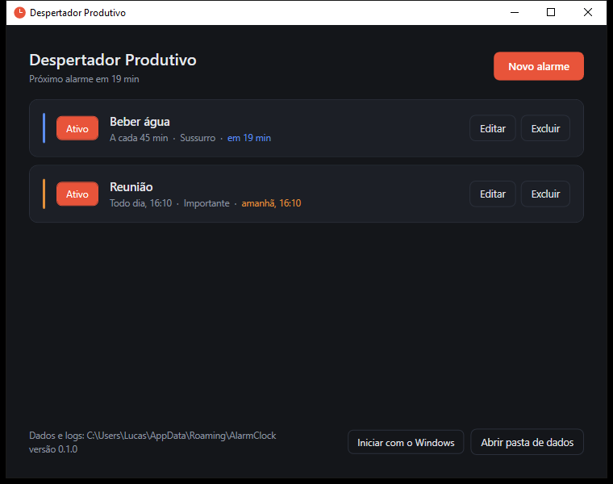
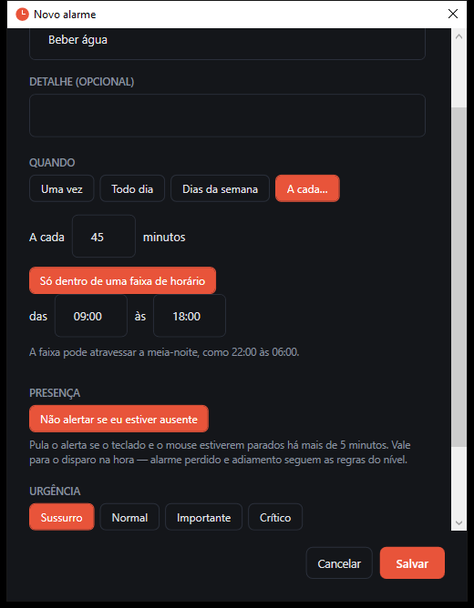
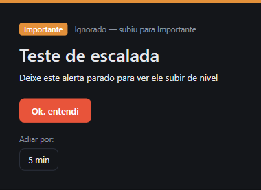

# ⏰ Despertador Produtivo

[](https://github.com/lukecarva/Alarm-Clock/actions/workflows/ci.yml)
[](https://dotnet.microsoft.com/download/dotnet/8.0)
[](LICENSE)

Despertador de bandeja para Windows, pensado para quem passa o dia no PC. A ideia
central são os **níveis de urgência**: cada alarme define o quão intrusivo é o
alerta — de um toast silencioso a um overlay em tela cheia que só sai com uma
ação deliberada. Alarmes ignorados **sobem de nível** sozinhos, e lembretes
cíclicos ("beba água a cada 45 min") não atrapalham quando você não está na
frente do computador.



## Recursos

- **Quatro níveis de urgência** — do toast discreto ao overlay em tela cheia.
- **Escalonamento automático** — ignorou por 10 min ou adiou 2 vezes? O alarme
  volta um nível acima, até Crítico. É o "mata-ignorância".
- **Agendas flexíveis** — uma vez, todo dia, dias da semana, ou a cada N minutos
  (com faixa de horário opcional, que pode atravessar a meia-noite).
- **Lembretes de saúde** — cíclicos, com detecção de ausência: não empilha
  avisos numa cadeira vazia.
- **Resistente a hibernação** — compara o relógio de parede a cada segundo, faz
  *catch-up* de alarmes perdidos e reage a mudanças de fuso e de relógio.
- **Adiamento por nível** — do ilimitado ao "uma vez só", conforme a urgência.
- **Som com fade** — toque sintetizado embutido, ou um arquivo seu.
- **Fica na bandeja** — fechar a janela esconde; sair é pelo menu do ícone.
- **Início com o Windows** — opcional, via `HKCU` (sem admin).

### Níveis de urgência

| Nível | Como aparece | Como sai |
|---|---|---|
| 🔵 Sussurro | Toast do Windows, sem som | Sozinho, em 7s |
| 🟢 Normal | Card no canto, um toque | Um clique. Adia 5/10/15 min à vontade |
| 🟠 Importante | Janela central, toque a cada 10s | Um clique. Adia 5 min, até 3x |
| 🔴 Crítico | Tela cheia em todos os monitores, som em loop | Segurar o botão 3s. Adia 2 min, uma vez só |

<table>
  <tr>
    <td></td>
    <td></td>
  </tr>
  <tr>
    <td align="center"><sub>Editor — agenda cíclica, presença e insistência</sub></td>
    <td align="center"><sub>Alerta que subiu de nível por ter sido ignorado</sub></td>
  </tr>
</table>

## Instalando

Baixe o `DespertadorProdutivo-Setup-<versão>.exe` (ou gere-o abaixo) e execute.
A instalação é **por usuário, sem admin**: cai em
`%LOCALAPPDATA%\Programs\Despertador Produtivo`, cria atalho no Menu Iniciar e
oferece "iniciar com o Windows" e atalho na área de trabalho como opcionais.
Desinstalar preserva seus dados em `%APPDATA%\AlarmClock`.

O app é *framework-dependent*: exige o **.NET 8 Desktop Runtime (x64)** — o
instalador detecta a ausência dele e mostra o link antes de seguir.

```powershell
winget install Microsoft.DotNet.DesktopRuntime.8
```

### Gerando o instalador

```powershell
pwsh build/build-installer.ps1
```

Sai em `build/dist/`. Requer o [Inno Setup 6](https://jrsoftware.org/isinfo.php)
uma vez (`winget install JRSoftware.InnoSetup`).

## Desenvolvimento

```bash
dotnet run --project src/AlarmClock.App   # rodar
dotnet test                               # testes (agendador, DST, catch-up…)
```

| Projeto | TFM | Papel |
|---|---|---|
| `src/AlarmClock.Core` | `net8.0` | Domínio e agendamento. Não conhece WPF — roda nos testes sem UI |
| `src/AlarmClock.App` | `net8.0-windows` | WPF: bandeja, janelas, áudio, bootstrap |
| `tests/AlarmClock.Core.Tests` | `net8.0` | xUnit, com `FakeClock` no lugar do relógio real |

O desenho e as decisões de projeto estão em **[docs/PLANO.md](docs/PLANO.md)**.

## Dados

Tudo em `%APPDATA%\AlarmClock`:

- `alarms.json` — seus alarmes, em JSON legível e editável à mão (escrita
  atômica; um arquivo corrompido vai para quarentena em vez de ser sobrescrito).
- `logs\log-*.txt` — 7 dias, UTF-8 com BOM, aberto em modo compartilhado (dá para
  ler com o app rodando).

## Licença

[MIT](LICENSE).
